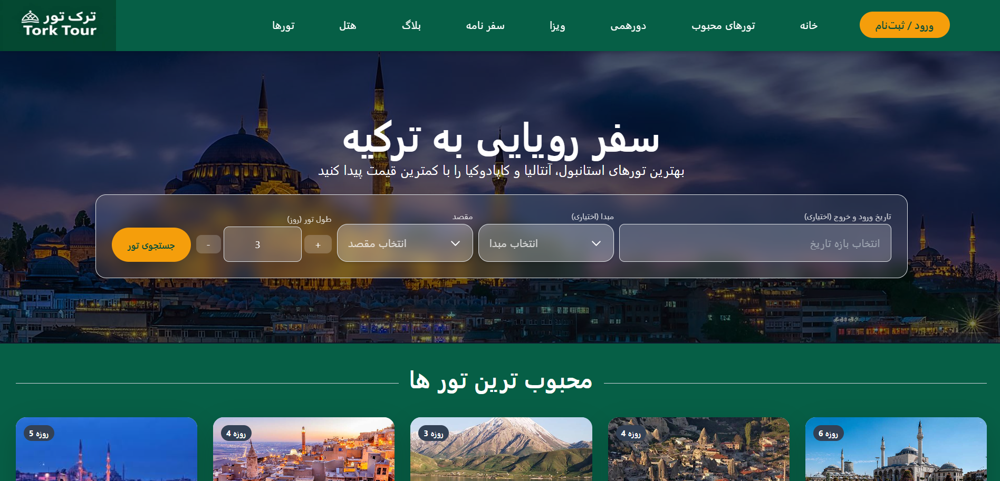

<div dir="rtl">

# تور تورک | Tour Torque



**تور تورک** یک وب‌سایت گردشگری مدرن، واکنش‌گرا و کاربرپسند است که با استفاده از **React** و **Tailwind CSS** طراحی و پیاده‌سازی شده است. هدف این پروژه نمایش تورهای مسافرتی، جزئیات سفرها و فراهم کردن امکان رزرو آسان برای کاربران می‌باشد.

## 🚀 نسخه‌ی آنلاین

[مشاهده‌ی دموی زنده](https://tour-torque-reactts.vercel.app/)  

## ✨ امکانات و ویژگی‌ها

- **طراحی کاملاً واکنش‌گرا:** مناسب برای تمامی دستگاه‌ها از جمله موبایل، تبلت و دسکتاپ.
- **نمایش لیست تورها:** نمایش جذاب تورها همراه با تصاویر و توضیحات کامل.
- **صفحه‌ی جزئیات تور:** دسترسی به اطلاعات دقیق شامل مدت سفر، قیمت و برنامه‌ی سفر.
- **جستجو و فیلتر هوشمند:** امکان فیلتر کردن تورها بر اساس مقصد، تاریخ و بازه قیمتی.
- **رابط کاربری (UI) مدرن:** رابط کاربری روان با استفاده از انیمیشن‌های ملایم و جذاب.
- **معماری کامپوننت‌محور:** استفاده از کامپوننت‌های قابل استفاده‌ی مجدد جهت توسعه‌ی بهینه.
- **عملکرد بالا:** بهینه‌سازی شده برای سرعت بارگذاری و تجربه کاربری عالی.

## 🛠️ تکنولوژی‌های استفاده شده

- [React](https://reactjs.org/) – کتابخانه‌ی اصلی برای ساخت رابط کاربری.
- [Tailwind CSS](https://tailwindcss.com/) – فریم‌ورک کاربردی برای طراحی سریع و مدرن.
- [React Router](https://reactrouter.com/) – مدیریت مسیرها و ناوبری در اپلیکیشن.
- [Axios](https://axios-http.com/) – مدیریت درخواست‌های HTTP (در صورت استفاده).
- [React Icons](https://react-icons.github.io/react-icons/) – استفاده از آیکون‌های متنوع و استاندارد.
- *سایر کتابخانه‌ها: (لیست کتابخانه‌های مورد نظر خود را اینجا اضافه کنید)*

## 📦 نصب و راه‌اندازی

برای اجرای پروژه روی سیستم خود، مراحل زیر را دنبال کنید:

1. اطمینان حاصل کنید که [Node.js](https://nodejs.org/) و npm روی سیستم شما نصب است.
2. یک کپی از مخزن را کلون کنید:
```bash
   git clone https://github.com/MobinDe/tour-torque.git
   
